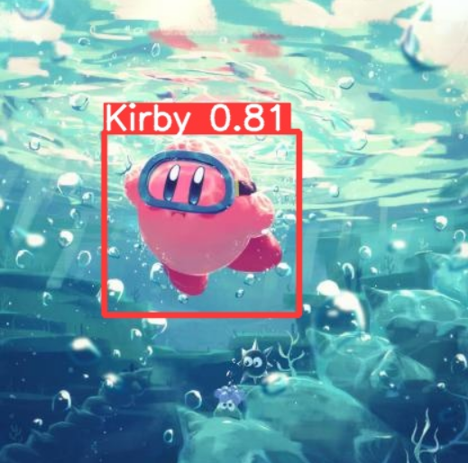
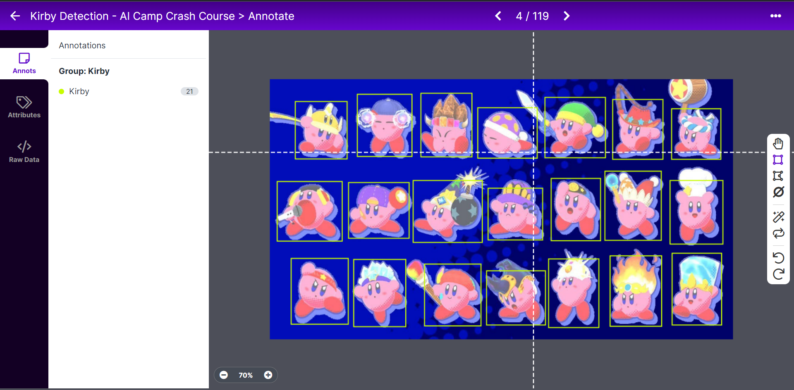

# Kirby-Detection
## Overview
This project is implemented for AI Camp Summer Data Science Intern Crash Course. The main purpose of this project is to detect Kirby in the images using YOLOv5. Kirby is an adorable action-platform video game character developed by HAL Laboratory and published by Nintendo.

## Dataset
I collected the images containing Kirby from Google Image. This images includs game posters, game screenshots, and fan works. These images was labled using [roboflox](https://roboflow.com/) by myself. For the video game screenshots, most of them all from Kirby and the Forgotten Land, the newest Kirby Game on Nitendo Switch. You could find the data used for training, validation and testing in [data](data) directory

## Main Scripts
1. Kirby_Detection_ver2.ipynb

I ran this notebook on Google Colab. Based on YOLOv5s6, the model here was trained for 200 epochs with the default hyperparameter setting. You could find the running result in this notebook, as well as [result](result) directory. 
