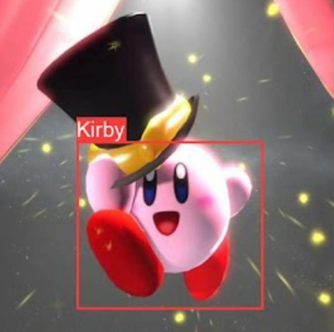

# Kirby-Detection
## Overview
This project is implemented for AI Camp Summer Data Science Intern Crash Course. The main purpose of this project is to detect Kirby in the images using YOLOv5. Kirby is an adorable action-platform video game character developed by HAL Laboratory and published by Nintendo.

## Dataset
I collected the images containing Kirby from Google Image. This images includs game posters, game screenshots, and fan works. These images was labled using [roboflox](https://roboflow.com/) by myself. For the video game screenshots, most of them all from Kirby and the Forgotten Land, the newest Kirby Game on Nitendo Switch. You could find the data used for training, validation and testing in [data](data) directory

## Main Scripts
1. code/Kirby_Detection_ver2.ipynb

I ran this notebook on Google Colab. Based on YOLOv5s6, the model here was trained for 200 epochs with the default hyperparameter setting. You could find the running result in this notebook, as well as [result](result) directory. 

## Result
Kirby is marked by bounding box! The detailed train, validation, and testing results (including the evaluation metrics (PR, Precision, Recall etc., confusion matrix, and graphic output) are shown in [result](result) directory. 

## Future Work
When I collected data, I found that most of the video game screenshots is from the newest released Nitendo Switch Game - Kirby and the Forgotten Land. In this game, the resolution is relatively high compared to the previous version of Kirby. In this case, this dataset may have potential bias. Besides, since most of the kirby are pink, being quite different from the surrouding game environment, so it would pretty easy for the model to simply find the pink area in the images. In this case, this object detection model have poor performance on pink background images. Expanding the data may help to solve these problem. 
