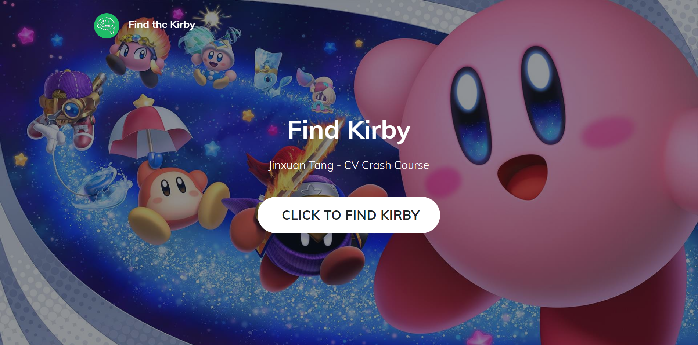
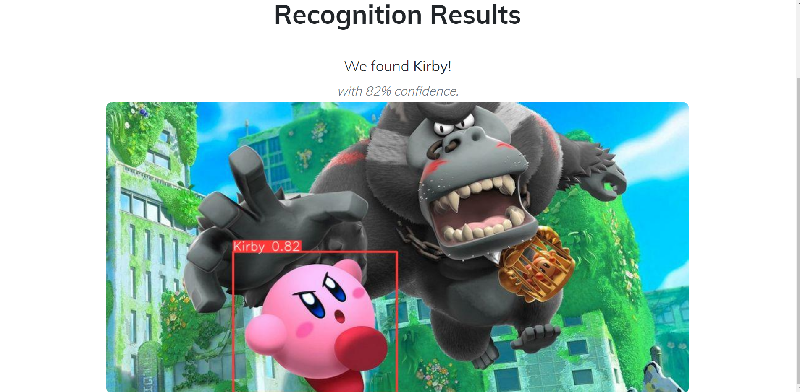
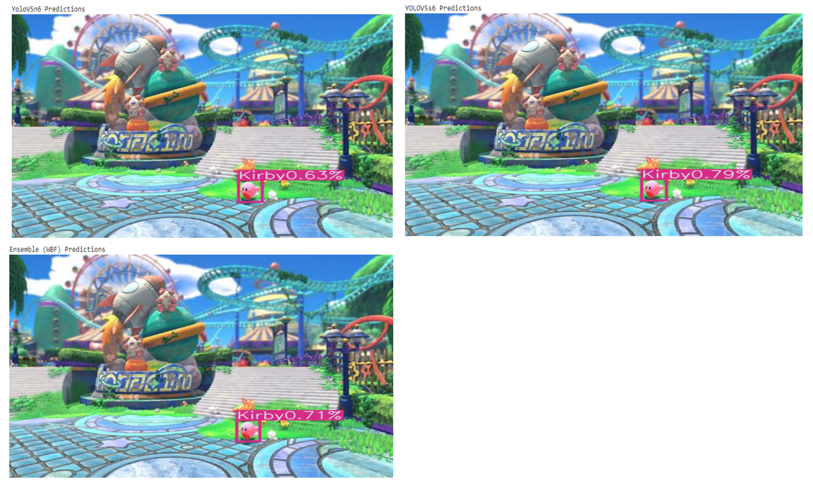

# Kirby-Detection
## Overview
This project is implemented for AI Camp Summer Data Science Intern Crash Course. The **minimum viable product (MVP)** is to detect Kirby in the images using YOLOv5. Kirby is an adorable action-platform video game character developed by HAL Laboratory and published by Nintendo. In the sense that detecting a game agent could be the first stage for developing some reinfocement learning algorithms based on video-games, I designed this project.

## Dataset
I collected the images containing Kirby from Google Image. This images includs game posters, game screenshots, and fan works. These images was labled using [roboflow](https://roboflow.com/) by myself. For the video game screenshots, most of them all from Kirby and the Forgotten Land, the newest Kirby Game on Nitendo Switch. You could find the data used for training, validation and testing in [data](data) directory. Due to limited time, the dataset only contains about 130 images.

## Script
1. [Kirby_Detection_ver2.ipynb](code/Kirby_Detection_ver2.ipynb)

I ran this notebook on Google Colab. Based on YOLOv5s6, the model here was trained for 200 epochs with the default hyperparameter setting. You could find the running result in this notebook, as well as [result](result) directory. The [pdf](code/Kirby_Detection_ver2.pdf) version of this notebook is also available.

2. [Kirby_Detection_Emsemble.ipynb](code/Kirby_Detection_Emsemble.ipynb)

To get a better performance, I trained both YOLOv5m6 and YOLOv5s6 model. Instead of using the inherited ensemble method in YOLO (NMS), I choose weighted box fusion, one of the state of art ensembling method for object detection. This notebook includs relative functions. Besides, some format transform functions (yolo, voc, coco) are also included for future use.

## Result
Kirby is marked by bounding box! The detailed train, validation, and testing results (including the evaluation metrics (PR, Precision, Recall etc., confusion matrix, and graphic output) are shown in [result](result) directory. After training, the recall is pretty high, almost equals to 1, while the precision is 80 % approximately. It means the model could nearly find every kirby in the image, and may mistakenly mark some none-kirby character.

## Web Deploy

The web deploying part is refered to the [web templates of AI Camp](https://github.com/organization-x/omni), the CV branch specifically. You could find relative codes and files in [deploy](deploy). To test the deployed web, after installing all the dependencies in [requirements.txt](deploy/app/requirements.txt) (using `pip install -r requirements.txt`), run the [main.py](deploy/app/main.py) (`python3 -m main`). Then you should have a link like https://cocalc4.ai-camp.dev/49d42078-2ad9-44c6-bf76-70f193709a84/port/12345/. Finally, let's find Kirby in the images!!!

## Ensemble

One of the most popular methods to upgrade model performance is model ensembling. As long as the base models are diverse and independent, the prediction error decreases when the ensemble approach is used. I use a state of art method for combining predictions of object detection models: [Weighted Box Fusion (WBF)](https://arxiv.org/abs/1910.13302). Introduced by Roman Solovyev et al. in 2019, the weighted box fusion (WBF) method uses confidence scores of all proposed bounding boxes to construct the average boxes. In this project, I trained yolov5s6 and yolov5m6 model, and use WBF method to ensemble their results. As shown in the following images, compared to the single model, the edge of the bounding box of the ensembling one are more close to Kirby. In addition, the weights of the base model are adjustable in this method, making it adaptable to different conditions.

## Future Work
### Dataset Bias & Diversity

When I collected data, I found that most of the video game screenshots are from the newest released Nitendo Switch Game - Kirby and the Forgotten Land. In this game, the resolution is relatively high compared to the previous version of Kirby. In this case, this dataset may have potential bias. Further, since most of the kirby are pink, being quite different from the surrouding game environment, so it would pretty easy for the model to simply find the pink area in the images. In this case, this object detection model have poor performance on pink background images. Besides, due to the time limitation, the dataset only contains 120+ images.

**Possible Solutions:** 
1. Increase the number of images in the data;
2. Enrich the diversity of the dataset: inlcude images (screenshots) from previous versions of games, add more images in pink background;
3. If the number of images is truly limited on the Internet, we could also use networks like GAN to produce more images;
4. Data Augmentation: We could write a yaml file to control this setting in YOLO.

### Model Performance Improvement
**Possible Solutions:** 
1. Model Ensembling: NMS, soft-NMS, Weighted Box Fusion (DONE!), etc;
2. Hyperparameter Tuning of YOLO architecture;
3. Data Augmentation: Use different augmentation methods to improve the performance. I trained yolov5n6 and yolov5s6 in default mode.

### Additional Functions
#### Object Tracking
We could add tracking algorithms to improve the overall performance of the system when it deals with streaming data, like a video game record. Tracking the agent in a streaming video would help in developing the game AI and the research of some AI and reinforcement learning algorithms.

**Possible Solutions:**
Norfair Library: https://github.com/tryolabs/norfair. This is the object tracking library I once used in a kaggle project.

#### Multiclass Detection
We could also check the ability of the detected Kirby (sword, wind, frozen, fire, etc), all the enemies and bonus in the game. In this case, we could set a whole training environment for AI development simply by inputting video records, which should be a cool thing.

**Possible Solutions:**
While expanding the whole dataset, define more labels.

## Acknowledgment
I'd like to express my sincere gratitude to Alex Duffy and Mitch Cutts at AI Camp, who helped me patiently and promptly when I encountered difficulties in this project. Look forward to colaborating with all the members of AI Camp this summer!

## Reference
1. YOLOv5 Document: https://github.com/ultralytics/yolov5
2. AI Camp Web Templates: https://github.com/organization-x/omni/tree/main/app
3. Roboflow: https://roboflow.com/
4. Solovyev, Roman, Weimin Wang, and Tatiana Gabruseva. "Weighted boxes fusion: Ensembling boxes from different object detection models." Image and Vision Computing 107 (2021): 104117. https://arxiv.org/abs/1910.13302
5. Weighted Box Fusion, https://github.com/ZFTurbo/Weighted-Boxes-Fusion
6. Norfair: https://github.com/tryolabs/norfair
